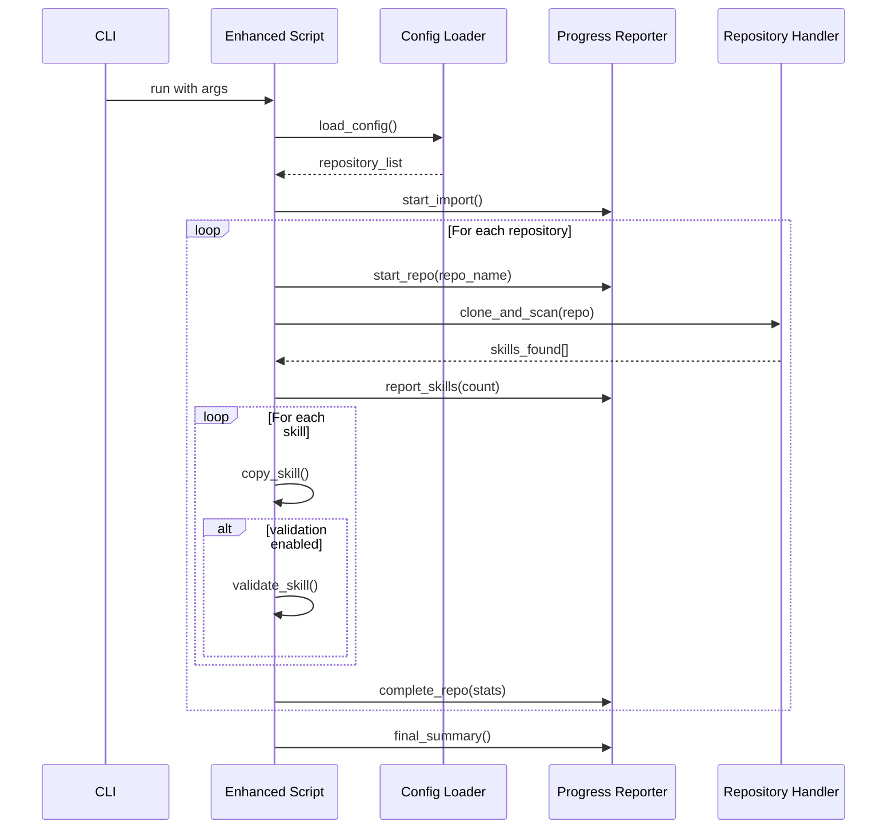

# Design Document: Simplified Skills Import Enhancement

## Overview

This design document outlines a simplified enhancement to the existing import_skills.py script. The approach focuses on practical improvements with minimal architectural changes, extending the current script rather than rebuilding it from scratch.

## Architecture

### Enhanced Script Structure

```mermaid
graph TB
    A[Enhanced import_skills.py] --> B[Config Loader]
    A --> C[Progress Reporter]
    A --> D[Error Handler]
    A --> E[Validator (Optional)]
    
    B --> F[YAML Parser]
    B --> G[JSON Parser]
    B --> H[Default Config]
    
    C --> I[Repository Progress]
    C --> J[Skill Count Display]
    C --> K[Summary Report]
    
    D --> L[Error Logging]
    D --> M[Graceful Continue]
    
    E --> N[SKILL.md Checker]
    E --> O[Frontmatter Validator]
```

### Data Flow



## Components and Interfaces

### 1. Configuration Loader

Extends the existing script to support external configuration files.

```python
class ConfigLoader:
    def load_config(self, config_path: Optional[str] = None) -> List[RepoSource]:
        """Load repository configuration from file or use defaults"""
        
    def _load_yaml(self, path: str) -> dict:
        """Load YAML configuration file"""
        
    def _load_json(self, path: str) -> dict:
        """Load JSON configuration file"""
        
    def _get_default_repos(self) -> List[RepoSource]:
        """Return default repository list including ComposioHQ"""
```

**Configuration Format:**
```yaml
# skills-config.yaml
repositories:
  - name: "anthropics_skills"
    url: "https://github.com/anthropics/skills.git"
    enabled: true
    
  - name: "agentskills_agentskills" 
    url: "https://github.com/agentskills/agentskills.git"
    enabled: true
    
  - name: "composio_awesome_skills"
    url: "https://github.com/ComposioHQ/awesome-claude-skills.git"
    enabled: true

settings:
  incremental: false
  validation: false
```

### 2. Progress Reporter

Provides clear feedback during the import process.

```python
class ProgressReporter:
    def start_import(self, total_repos: int):
        """Initialize import progress tracking"""
        
    def start_repo(self, repo_name: str, index: int):
        """Report starting repository processing"""
        
    def report_skills(self, repo_name: str, skill_count: int):
        """Report number of skills found in repository"""
        
    def report_error(self, repo_name: str, error: str):
        """Report repository processing error"""
        
    def final_summary(self, stats: ImportStats):
        """Display final import summary"""
```

### 3. Error Handler

Ensures robust operation when repositories fail.

```python
class ErrorHandler:
    def handle_repo_error(self, repo_name: str, error: Exception) -> bool:
        """Handle repository-level errors, return True to continue"""
        
    def handle_skill_error(self, skill_path: str, error: Exception):
        """Handle individual skill processing errors"""
        
    def get_error_summary(self) -> List[str]:
        """Return list of all errors encountered"""
```

### 4. Basic Validator (Optional)

Simple validation for skill file format.

```python
class BasicValidator:
    def validate_skill(self, skill_path: Path) -> ValidationResult:
        """Perform basic validation on skill file"""
        
    def _check_skill_md_exists(self, skill_dir: Path) -> bool:
        """Check if SKILL.md file exists"""
        
    def _validate_frontmatter(self, skill_md_path: Path) -> List[str]:
        """Validate YAML frontmatter format and required fields"""
```

## Data Models

### Enhanced Data Structures

```python
@dataclass
class RepoSource:
    name: str
    url: str
    enabled: bool = True
    branch: Optional[str] = None

@dataclass 
class ImportStats:
    total_repos: int
    successful_repos: int
    failed_repos: int
    total_skills: int
    new_skills: int
    updated_skills: int
    skipped_skills: int
    validation_errors: int
    
@dataclass
class ValidationResult:
    valid: bool
    errors: List[str]
    warnings: List[str]
```

## Correctness Properties

*A property is a characteristic or behavior that should hold true across all valid executions of a system-essentially, a formal statement about what the system should do. Properties serve as the bridge between human-readable specifications and machine-verifiable correctness guarantees.*

**Property 1: Configuration Loading**
*For any* valid YAML or JSON configuration file, the Import_Script should parse it correctly and use the specified repositories, falling back to defaults when no config exists
**Validates: Requirements 1.1, 1.2, 1.3, 1.4**

**Property 2: Progress Reporting**
*For any* import operation, the Import_Script should display current repository being processed, show skill counts, and provide a final summary
**Validates: Requirements 2.1, 2.2, 2.3, 2.4**

**Property 3: Error Resilience**
*For any* import operation where some repositories fail, the Import_Script should continue processing remaining repositories and report both successes and failures
**Validates: Requirements 3.1, 3.2, 3.3, 3.4**

**Property 4: Enhanced Preview**
*For any* dry-run operation, the Import_Script should show repository URLs, skill paths, and counts without making actual changes
**Validates: Requirements 4.1, 4.2, 4.3, 4.4**

**Property 5: Incremental Import (Optional)**
*For any* incremental import operation, the Import_Script should compare timestamps and only update newer or missing skills
**Validates: Requirements 5.1, 5.2, 5.3, 5.4**

**Property 6: Basic Validation (Optional)**
*For any* skill being imported with validation enabled, the Import_Script should check for SKILL.md existence, frontmatter format, and required fields
**Validates: Requirements 6.1, 6.2, 6.3, 6.4, 6.5**

## Error Handling

### Error Categories
1. **Configuration Errors**: Invalid YAML/JSON, missing files
2. **Repository Errors**: Clone failures, network issues, access denied
3. **File System Errors**: Permission issues, disk space
4. **Validation Errors**: Invalid SKILL.md format, missing fields

### Error Handling Strategy
- **Continue on Error**: Repository failures don't stop the entire process
- **Clear Reporting**: All errors are logged and summarized
- **Graceful Degradation**: Partial success is better than total failure
- **User Feedback**: Clear error messages help users fix issues

## Testing Strategy

### Dual Testing Approach

**Unit Tests** will focus on:
- Configuration file parsing (valid and invalid files)
- Progress reporting output verification
- Error handling for specific failure scenarios
- Validation logic for SKILL.md files

**Property-Based Tests** will verify:
- Configuration loading across various file formats
- Error resilience with simulated repository failures
- Progress reporting consistency
- Validation behavior across different skill formats

### Testing Framework

Using **pytest** for unit tests and **Hypothesis** for property-based testing:
- Custom generators for configuration files
- Mock repository scenarios for error testing
- File system fixtures for skill validation testing

Each property test will be tagged with:
**Feature: enhanced-skills-import, Property {number}: {property_text}**